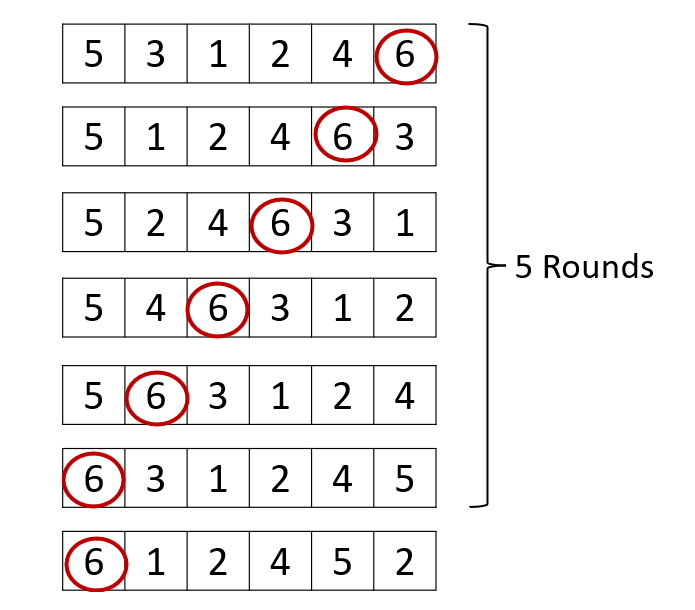

## 初めに
こんにちは。この記事では先日(2022/08/16)行われたCodeforces Round #814 (Div. 2)のA, B, C問題の解説をPython3を用いてしていきます。Codeforcesは解説がAtCoderほど十分にないこと、そもそもPythonを使って解いている人も少ないことから、自身の解法とコードを共有しようと考えました。解説はコンテスト中に解けた問題＋1問のみとしています。宜しくお願いします。

### コンテストへのリンク
[Codeforces](https://codeforces.com/) \
[Round #814 (Div. 2)](https://codeforces.com/contest/1719)

- [初めに](#初めに)
  - [コンテストへのリンク](#コンテストへのリンク)
- [Problem A Chip game](#problem-a-chip-game)
  - [問題文](#問題文)
  - [入力](#入力)
  - [出力](#出力)
  - [解法](#解法)
  - [ACコード](#acコード)
- [B問題 Mathematical Circus](#b問題-mathematical-circus)
  - [問題](#問題)
  - [入力](#入力-1)
  - [出力](#出力-1)
  - [解法](#解法-1)
  - [ACコード](#acコード-1)
- [C問題 Fighting Tournament](#c問題-fighting-tournament)
  - [問題](#問題-1)
  - [入力](#入力-2)
  - [出力](#出力-2)
  - [解法](#解法-2)
  - [ACコード](#acコード-2)


## Problem A Chip game
[Problem A](https://codeforces.com/contest/1719/problem/A)

### 問題文
BurenkaとTonyaが$n\times m$マスの盤上でゲームをしています。最初にコマが左下のマスに置かれます。一回のターンで、プレイヤーはコマを奇数回上か右に動かすことができます。一回のターンでは上か右かのどちらかに動くことしかできません。最初にコマを動かすことのできなくなったプレイヤーの負けです。

Burenkaが最初にコマを動かし、Tonyaと交互にコマを動かします。双方が最適な戦略を取る時、どちらのプレイヤーが勝つか求めてください。

### 入力
$t \space(1 \leq t \leq 10^4)$: テストケースの数 \
それぞれのテストケースにおいて、 \
$n, m \space(1 \leq n, m \leq 10^9)$

### 出力
ゲームの勝者を出力。

### 解法

$n$と$m$の偶奇で場合分けをすれば解くことができます。親切なことにテストケースで全ての偶奇の組み合わせを網羅してくれているので、それを参考にしてください。

|     | $m$は奇数 | $m$は偶数 | 
| --- | --- | --- |
|$n$は奇数 |  Tonya |  Burenka  | 
|$n$は偶数 | Burenka  |  Tonya  |

上記の表をコードにすると以下のようになります。
```python
n, m = map(int, input().split())
# ｎもｍも共に奇数の場合はTonya
if n % 2 == 1 and m % 2 == 1:
    print("Tonya")
# 共に偶数の場合もTonya
elif n % 2 == 0 and m % 2 == 0:
    print("Tonya")
# それ以外の場合はBurenka 
else:
    print("Burenka")
```
Tonyaが勝つ場合は$n$と$m$の偶奇が一致することを用いれば、$n+m$の偶奇を判定することで```if```文を減らしたコードを書くこともできます。
```python
n, m = map(int, input().split())
if (n+m) % 2 == 0:
    print("Tonya")
else: 
    print("Burenka)
```


### ACコード
この操作を各テストケース毎に行えばACとなります。

```python
for _ in range(int(input())):
    n, m = map(int, input().split())
    if (n+m) % 2 == 0:
        print("Tonya")
    else:
        print("Burenka")
```

## B問題 Mathematical Circus
[Problem B](https://codeforces.com/contest/1719/problem/B)

### 問題
二つの数$n$と$k$が与えられます。$n$は偶数です。$1$から$n$までの整数全てを使って$(a+k)\times b$ が$4$の倍数となるように$(a,b)$のペアを$\frac{n}{2}$個作ります。整数は全て一度しか使われないものとします。このようなペアを作ることができるか判定し、可能な場合はそのような組み合わせを出力してください。
### 入力
$t \space(1 \leq t \leq 10^4)$: テストケースの数 \
それぞれのテストケースにおいて、\
$n\space(2 \leq n \leq 2\times 10^5)$, $k\space (0 \leq k \leq 10^9)$

### 出力
ペアを作ることが可能なら```YES```、不可能なら```NO```と出力します。
```YES```と出力した場合、$\frac{n}{2}$行で$a$、$b$のペアを出力してください。

### 解法
$(a+k) \times b$が$4$の倍数となることに着目します。2つの整数の積が$4$の倍数になるとき、それは
1. どちらか一方の数が4の倍数である
2. どちらも2の倍数である 

のどちらかのパターンになります。このことを抑えつつ、テストケースと想定出力を眺めてみましょう。連続する2整数がペアとして出力されていることが多いのが分かると思います。連続する2整数を用いてなにか出来ないか考えてみます。

連続する2整数は必ずどちらかは偶数です。したがって、もう片方の奇数が偶数になればそれらの積は必ず$4$の倍数になります。
$(a+k) \times b$ で連続する2整数を$a$,$b$と置き、$b$を偶数とすると、$(a+k)$が偶数となることで4の倍数を作ることが出来ます。$a$は奇数なので$k$が奇数であれば条件を満たします。

以上により、$k$が奇数の場合は必ず条件を満たすようなペアを作ることができ、このとき以下のようなコードでペアを出力できます。
```python 
if k % 2 == 1:
    print("YES")
    # ペアをn/2個出力します
    for i in range(n//2):
        # (1,2), (3,4), (5,6) ...
        print(i*2+1, i*2+2)
```

$k$が偶数の場合を考えます。$a+k$の偶奇は$a$の偶奇と同じになります。$1$から$n$までの間には$\frac{n}{4}$個の4の倍数が存在し、$\frac{n}{4}$個の4の倍数ではない偶数が存在し、$\frac{n}{2}$個の奇数が存在します。$a+k$の偶奇は$a$の偶奇と一致するため、奇数に$k$を足して偶数にすることはできません。奇数と偶数が同じ数存在する以上、全ての偶数を4の倍数にすることができなければ$\frac{n}{2}$個のペアを作ることはできません。従って、$k$がどのような値ならば$4$の倍数でない偶数を$4$の倍数にすることができるか考えます。

$4$の倍数でない偶数とは$4$で割ると$2$余るような数のことです。このような数に$k$を足して$4$の倍数にするためには、$k$も$4$の倍数でない偶数である必要があります。このような場合、ペアは次の2パターンを用いて生成できます。
1. $4$の倍数でない偶数を$a$とし、$b$として奇数を選ぶ
2. $4$の倍数を$b$とし、$a$として奇数を選ぶ
   
このようにペアを作れば、どのように選んでも条件を満たします。

最後に$k$が$4$の倍数である場合を検討します。この場合、奇数に足しても$4$の倍数でない偶数に足しても$4$の倍数を作ることは出来ないので、条件を満たすペアを作るのは不可能です。よって```NO```を出力します。

以上のパターンをコードにすると以下のようになります。
```python
if k % 2 == 0:
    if k % 4 == 2
        print("YES")
        for i in range(1, n+1):
            if i % 4 == 0:
            print(i-1, i)
        elif i % 4 == 2:
            print(i, i-1)
    else:
        print("NO")

```
### ACコード
全ての操作をテストケース毎に行うとACとなります。
```python
for _ in range(int(input())):
    n, k = map(int, input().split())
    if k % 2 == 1:
        print("YES")
        for i in range(n // 2):
            print(i*2+1, i*2+2)
    else:
        if k % 4 == 2:
            print("YES")
            for i in range(1, n+1):
                if i % 4 == 0:
                    print(i-1, i)
                elif i % 4 == 2:
                    print(i, i-1)
        else:
            print("NO")
```

## C問題 Fighting Tournament 
[Problem C](https://codeforces.com/contest/1719/problem/C)

### 問題
$1$から$n$まで番号付けされた$n$人の選手が試合を行います。$i$番目の選手の強さは$a_i \space(1 \leq a_i \leq n)$ です。強さの値はすべて異なります。試合では、$a_i > a_j$ の時 $i$番目の選手が必ず勝利します。

試合開始時には$n$人の選手が番号順に並び、試合は無限ラウンド行うことができます。それぞれのラウンドで試合は一回行われます。列に並んでいる最初の2人が試合を行い、勝者は列の先頭に戻り、敗者は列の最後尾につきます。

今、$q$個の質問がされます。それぞれの質問で、$i$番目の選手が始めの$k$ラウンドまでで何回勝利したかが問われます。質問への回答を出力してください。

### 入力
$t \space (1 \leq t \leq 10^4)$ \
それぞれのテストケースにおいて、\
$n \:(2 \leq n \leq 10^5)$, $q \:(1 \leq q \leq 10^5)$\
$a_1, a_2, a_3, ..., a_n$\
$i_1, k_1$\
$i_2, k_2$\
$\vdots \quad\vdots$ \
$i_q, k_q$

### 出力
それぞれの質問に対しその答えを出力してください。

### 解法
何回か適当な数で実験をすると、$n-1$ラウンド以降は最強の選手以外は全員負け続けるということがわかります。



上の図でも示しましたが、$5$ラウンド目以降は強さ$6$の選手が常に試合に出るため、相手の選手は必ず負けてしまいます。

故に、$n-1$ラウンド目までを愚直にシミュレーションし、そのあとは最強選手なら試合の数だけ勝利も増える、それ以外の選手なら$n-1$ラウンド目までの勝利数から増えない、という形で実装できます。実際の実装では、$n-1$ラウンド目まではなく$n$ラウンド目までシミュレーションしています (コードの煩雑さを抑えるため)。

なお、$k < n$ の場合は、$n$ラウンド目までの結果を二次元配列で維持しておくことで二分探索を用いて勝利数を求めることができます。


### ACコード

```python
from collections import deque
from bisect import bisect_right

for _ in range(int(input())):
    n, q = map(int, input().split())
    a = list(map(int, input().split()))
    # 最強選手はだれで何番目なのか
    strongest_player = max(a)
    strongest_player_ind = a.index(strongest_player)
    # 先頭と末尾にしかアクセスしないため、それらにO(1)でアクセスできるdequeを使います。
    a = deque([(i+1, a[i]) for i in range(n)])
    # nラウンド目までで勝利したラウンド
    wins = [[] for j in range(n)]
    for t in range(1, n+1):
        # ここからは試合の愚直シミュレーションです
        p1_ind, p1 = a.popleft()
        p2_ind, p2 = a.popleft()
        if p1 > p2:
            a.appendleft((p1_ind, p1))
            a.append((p2_ind, p2))
            # 勝った選手の配列にラウンドを追加します
            wins[p1_ind-1].append(t)
        else:
            a.appendleft((p2_ind, p2))
            a.append((p1_ind, p1))
            wins[p2_ind-1].append(t)
    
    # 質問に答えていきます
    for _ in range(q):
        i, k = map(int, input().split())
        # 選手番号は0-indexで処理しているので
        # １引いておきます
        i -= 1 
        if k < n:
            ans = bisect_right(wins[i], k)
            print(ans)
        else:
            if i == strongest_player_ind:
                print(len(wins[i]) + (k-n))
            else:
                print(len(wins[i]))
```

以上、A,B,C問題の解説でした。質問や間違い等ありましたらコメントでご指摘頂ければ幸いです。


